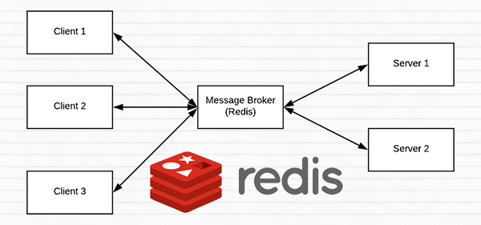
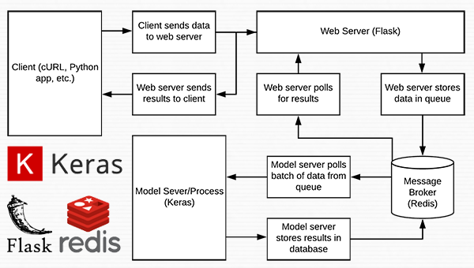

# A scalable Keras + deep learning REST API
We’ll start with a brief discussion of the [Redis data store](https://redis.io/) and how it can be used 
to facilitate message queuing and message brokering.

From there, we’ll configure our Python development environment by installing the required Python packages
to build our Keras deep learning REST API.

Once we have our development environment configured we can implement our actual Keras deep learning REST API 
using the Flask web framework. After implementing, we’ll start the Redis and Flask servers, 
follow by submitting inference requests to our deep learning API endpoint using both cURL and Python.

Finally, we’ll end with a short discussion on the considerations you should keep in mind 
when building your own deep learning REST API.

## A short introduction to Redis as a REST API message broker/message queue



[Redis]((https://redis.io/)) is an in-memory data store. It is different than a simple key/value store 
(such as memcached) as it can store actual data structures.

Today we’re going to utilize Redis as a message broker/message queue. This involves:

 - Running Redis on our machine
 - Queuing up data (images) to our Redis store to be processed by our REST API
 - Polling Redis for new batches of input images
 - Classifying the images and returning the results to the client

To read more about Redis, I encourage you to review this [short introduction](https://redis.io/topics/introduction).

### Configuring and installing Redis for our Keras REST API

Redis is very easy to install. Below you’ll find the commands to download, extract, and install Redis on your system:

```shell
wget http://download.redis.io/redis-stable.tar.gz
tar xvzf redis-stable.tar.gz
cd redis-stable
make
sudo make install
```

To start the Redis server, use the following command:

```shell
redis-server
```

Leave this terminal open to keep the Redis data store running.

In another terminal, you can validate Redis is up and running:

```shell
redis-cli ping
```

Provided that you get a PONG back from Redis, you’re ready to go.

### Configuring your Python development environment to build a Keras REST API

I recommend that you work on this project inside of a Python virtual environment so that it does not impact system level Python and projects.

### Implementing a scalable Keras REST API



